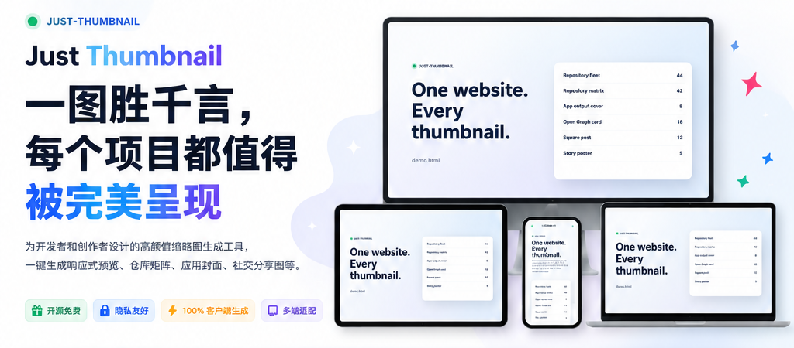
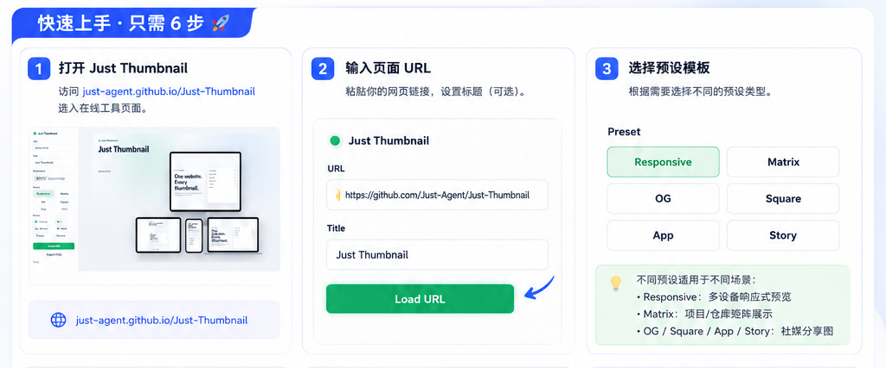
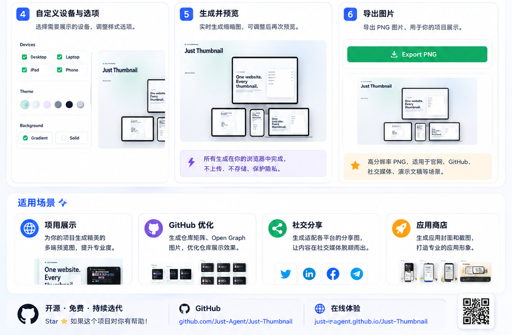
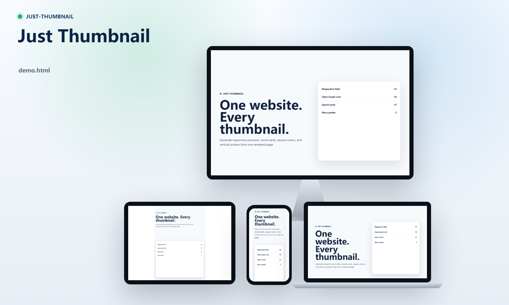
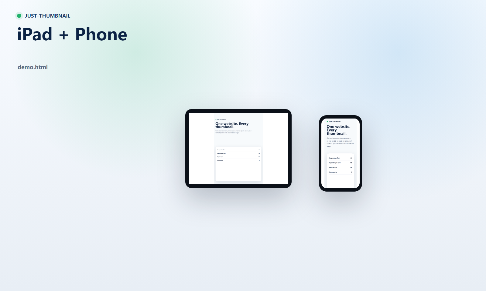
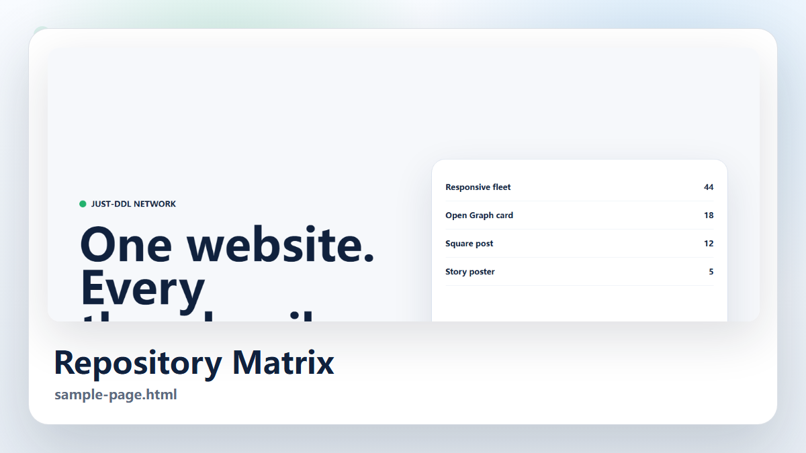
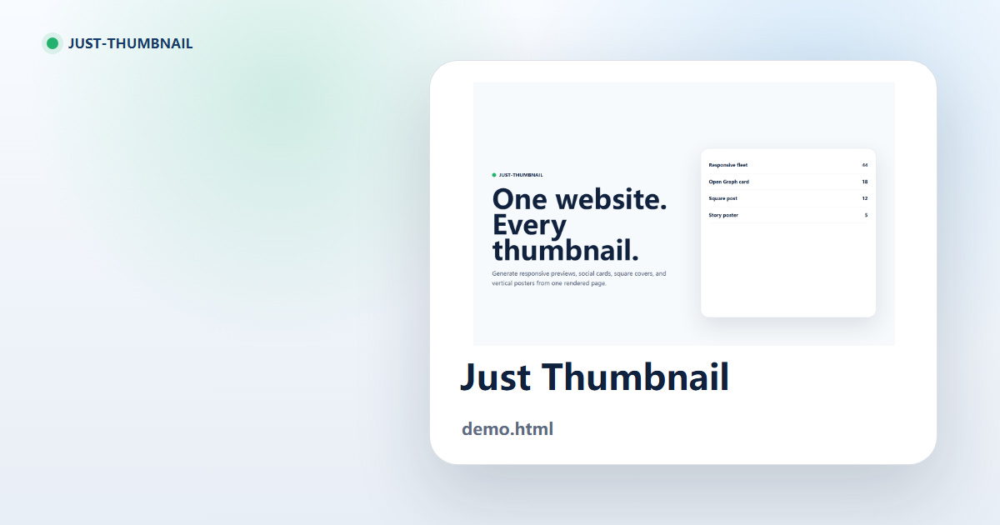
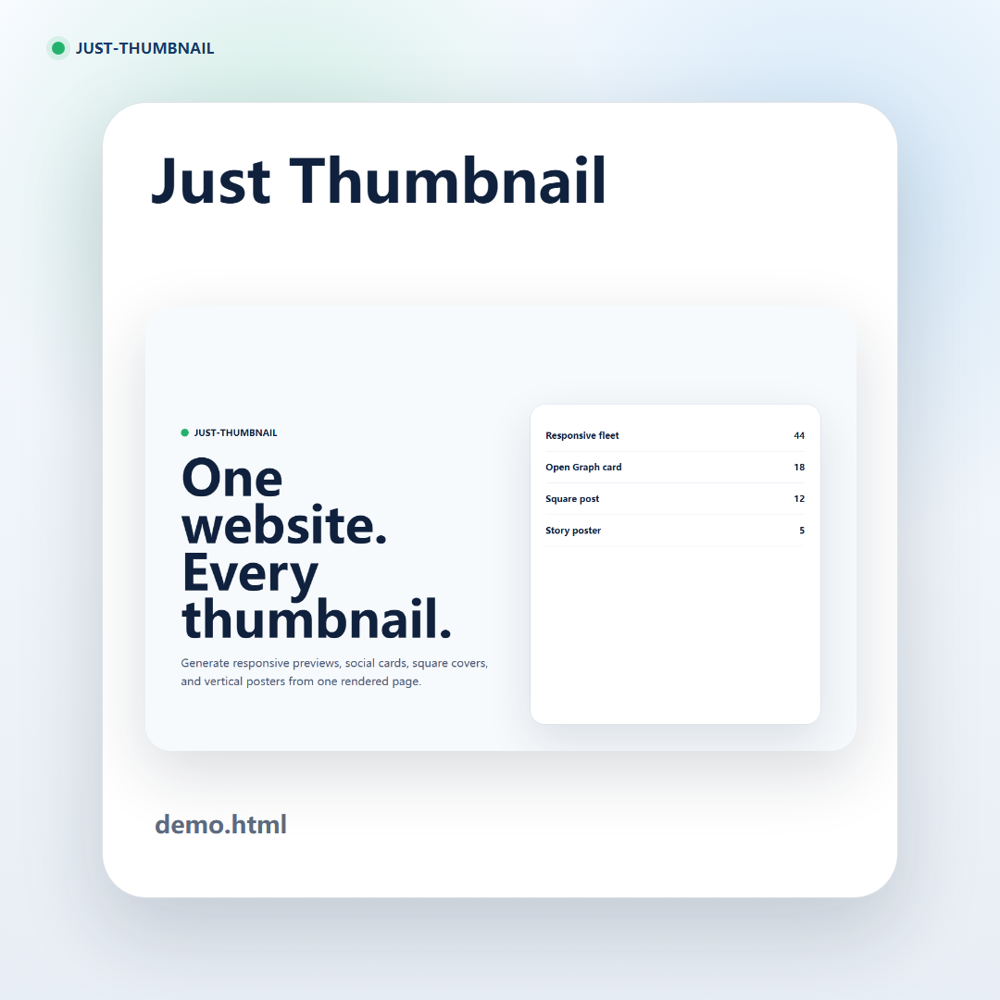
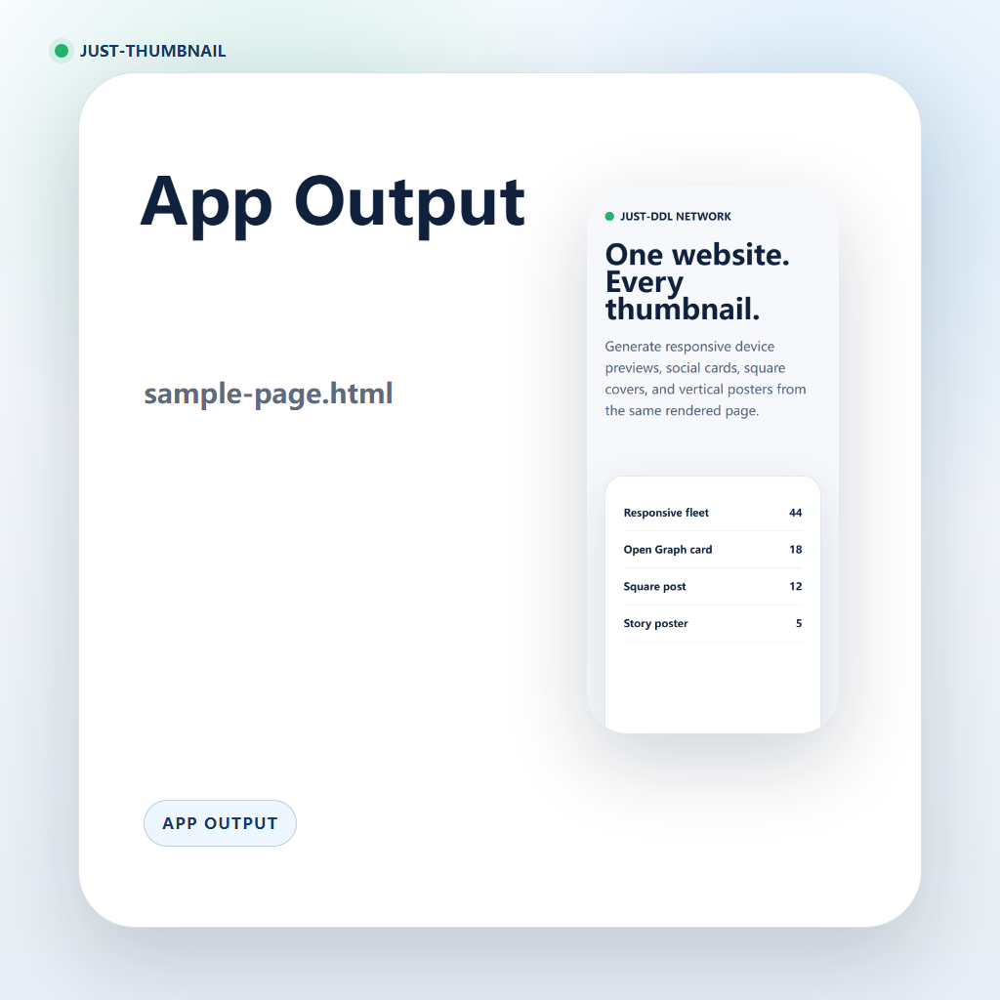
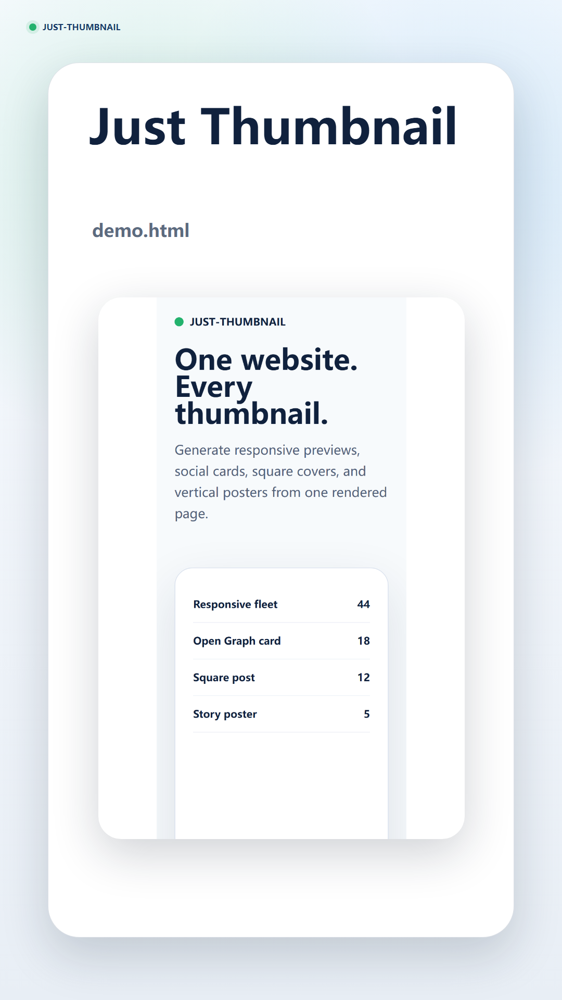

<div align="center">

# Just Thumbnail

一图胜千言，每个项目都值得被完美呈现。

Generate polished website thumbnails for responsive previews, repository matrices, Open Graph cards, app covers, square posts, and vertical story posters.

[](https://github.com/Just-Agent/Just-Thumbnail/actions/workflows/pages.yml)
[](https://just-agent.github.io/Just-Thumbnail/)
[](LICENSE)
[](https://playwright.dev/)

[在线体验](https://just-agent.github.io/Just-Thumbnail/) · [Codex Skill](SKILL.md) · [CLI Script](scripts/just-thumbnail.mjs)



</div>

## At a Glance

| Input | Composer | Outputs |
| --- | --- | --- |
| Page URL or screenshot | Browser demo or local Playwright CLI | Responsive preview, repository matrix, Open Graph card, square post, app cover, story poster |

## Contents

- [Why Just Thumbnail](#why-just-thumbnail)
- [Quick Tutorial](#quick-tutorial)
- [Presets](#presets)
- [Preview Gallery](#preview-gallery)
- [Usage Scenarios](#usage-scenarios)
- [CLI Quick Start](#cli-quick-start)
- [Web Demo](#web-demo)
- [Codex Skill](#codex-skill)

## Why Just Thumbnail

Just Thumbnail turns one URL or screenshot into platform-ready preview images. It is built for README heroes, GitHub social previews, project galleries, release notes, app store materials, and social sharing cards.

- **开源免费**: static GitHub Pages demo plus local CLI workflow.
- **隐私友好**: browser composition and local rendering avoid uploading private project visuals.
- **客户端生成**: the web demo exports from your browser; the CLI renders locally.
- **多端适配**: one source can become README hero images, GitHub preview cards, social posts, and app covers.
- **批量稳定**: the CLI can regenerate all preset sizes from the same source for repeatable releases.

## Quick Tutorial

<p align="center">
  
</p>

<p align="center">
  
</p>

1. Open [just-agent.github.io/Just-Thumbnail](https://just-agent.github.io/Just-Thumbnail/).
2. Paste a page URL and optionally set a title.
3. Choose a preset: `Responsive`, `Matrix`, `OG`, `Square`, `App`, or `Story`.
4. Select the devices and style options you want to show.
5. Preview the generated thumbnail in the browser.
6. Export a PNG for GitHub, social media, docs, slides, or app store materials.

## Presets

Pick the preset by destination first, then adjust devices and visual style.

| Preset | Output | Best for |
| --- | --- | --- |
| `responsive` | `1600x960` | README hero, product showcase, multi-device website preview |
| `matrix` | `1200x675` | Repository matrices, project cards, GitHub Pages galleries |
| `og` | `1200x630` | Open Graph, Twitter/X card, link preview |
| `square` | `1080x1080` | App store cover, social post, marketplace thumbnail |
| `app` | `1024x1024` | App output card, mobile product preview, release showcase |
| `story` | `1080x1920` | Vertical poster, mobile story, short-form preview |

## Preview Gallery

Responsive thumbnails can show all devices or only the devices you choose.

<p align="center">
  
</p>

<p align="center">
  
</p>

<p align="center">
  
</p>

<p align="center">
  
  
</p>

<p align="center">
  
  
</p>

## Usage Scenarios

| Scenario | What to generate | Why it helps |
| --- | --- | --- |
| 项目展示 | `responsive`, `matrix` | Show the product across desktop, tablet, and phone in README or docs. |
| GitHub 优化 | `og`, `matrix` | Create repository preview images and Open Graph assets for sharing. |
| 社交分享 | `og`, `square`, `story` | Prepare platform-friendly cards for X, LinkedIn, Facebook, Telegram, and mobile feeds. |
| 应用商店 | `app`, `square` | Generate app output covers, release visuals, and marketplace thumbnails. |

## Choose Web or CLI

| Path | Best when | Notes |
| --- | --- | --- |
| [Web demo](https://just-agent.github.io/Just-Thumbnail/) | You want to compose and export one image quickly. | Works as a static GitHub Pages app; URL preview depends on browser iframe and tab-capture support. |
| CLI | You want reliable URL rendering, all presets, or repeatable release assets. | Uses Playwright locally and can render sites that block iframe previews. |
| Codex skill | You want Codex to generate thumbnail assets during repository work. | Uses this repository's `SKILL.md` and CLI workflow. |

## CLI Quick Start

```bash
git clone https://github.com/Just-Agent/Just-Thumbnail.git
cd Just-Thumbnail
npm install
npm link
thumb https://example.com
```

By default `thumb <url>` generates every preset into `out/<site>/`:

```text
out/example/
  responsive.png
  matrix.png
  og.png
  square.png
  app.png
  story.png
  captures/
  manifest.json
```

Generate only one preset:

```bash
thumb https://example.com --preset og --out out/example-og --title "Example"
thumb https://example.com --preset matrix --out out/example-matrix --title "Example"
thumb https://example.com --preset app --out out/example-app --title "Example App"
```

Choose which devices appear in the responsive thumbnail:

```bash
thumb https://example.com --preset responsive --devices desktop,tablet,phone
thumb https://example.com --preset responsive --devices tablet,phone
thumb https://example.com --preset responsive --devices phone
```

Device aliases also work: `pc`, `ipad`, `mobile`, and `iphone`.

## Web Demo

The static demo is available at [just-agent.github.io/Just-Thumbnail](https://just-agent.github.io/Just-Thumbnail/).

The browser version supports two modes:

| Mode | How to export |
| --- | --- |
| Upload screenshot | Choose an image, pick a preset, click `Export PNG`. This exports directly. |
| URL preview | Click `Export PNG`, choose the current Just Thumbnail tab in Chrome's share dialog, click `Share`, keep the tab visible for one second. |

When `Responsive` is selected, use the device checkboxes to choose Desktop, Laptop, iPad, Phone, or any smaller combination.

> For fully automatic URL-to-PNG generation, prefer the CLI: `thumb https://example.com`.

## Codex Skill

This repository is also a Codex skill. Install or link this folder into your Codex skills directory, then ask Codex for website thumbnails from a URL or screenshot.

```text
just-thumbnail/
  SKILL.md
  scripts/just-thumbnail.mjs
  docs/
```

Example prompt:

```text
Use just-thumbnail to generate responsive and Open Graph thumbnails for https://example.com.
```

## README Assets

| Asset | Purpose |
| --- | --- |
| `docs/readme-assets/tutorial-cover-intro.png` | README hero and product positioning |
| `docs/readme-assets/tutorial-steps-1-to-3.png` | Browser workflow steps 1 to 3 |
| `docs/readme-assets/tutorial-steps-4-to-6-scenarios.png` | Browser workflow steps 4 to 6 and usage scenarios |
| `docs/readme-assets/responsive.png` | Responsive multi-device preview |
| `docs/readme-assets/matrix.png` | Repository matrix preview |
| `docs/readme-assets/og.png` | Open Graph preview |
| `docs/readme-assets/square.png` | Square social preview |
| `docs/readme-assets/app.png` | App output preview |
| `docs/readme-assets/story.png` | Vertical story preview |

## Notes

- The CLI uses Playwright, so it captures real rendered pages at desktop, laptop, tablet, and phone viewports.
- `matrix` uses a centered, full-width website screenshot so small project cards do not look right-heavy.
- `app` uses a phone capture and a square composition for app/release output cards.
- `responsive` supports custom device combinations with `--devices`.
- If a website is not responsive, the mobile/tablet thumbnails will show that real layout behavior.
- Static GitHub Pages cannot run a backend browser renderer or bypass cross-origin rules; that is why the web demo uses iframe preview, screenshot upload, or Chrome tab capture.
- Some sites block iframe display. Use the CLI for those sites.
- README images are stored under `docs/readme-assets/` so GitHub renders them without external asset hosting.

## License

MIT
